# qBOT_Repositorio

## Información
* Autor: Pablo García Jaén (twitter: [@pablogarciajaen](https://twitter.com/PabloGarciaJaen)  )
* Web: http://qbotproject.com/
* Licencia: Creative Common CC BY-NC-SA 

## Materiales
| Artículo                           | Cantidad* |
| ---------------------------------- | --------- |
| Arduino Nano                       | 1         |
| GearMotor N20                      | 3         |
| Acoplamiento para el eje N20 (3mm) | 3         |
| GearMotor N20 Eje m4               | 3         |
| Servo sg90 (TowerPro)              | 3         |
| Aspa servo SG90                    | 1         |
| Imán Neodimio N42 9x3mm            | 6         |
| Pin Macho (4 pines juntos)         | 3         |
| Pin Hembra (4 pines juntos)        | 12        |
| Driver de motores SN754410         | 3         |
| Potenciometro                      | 3         |
| Tornillería                        | -         |
| 3D                                 | -         |

* *CANTIDAD PARA UN qBOT

## Hazlo tu mismo (DIY)

`Parte 1: Cara A` 

#### 	Diseño:

#### 	Archivos 3D:

Haz click para descargarlas

- [CaraA.1_Pieza1.stl](https://github.com/PabloGarciaJaen/qBOT_Repositorio/blob/master/Archivos%203D/CaraA.1_Pieza1.stl)

- [CaraA.1_Pieza2.stl](https://github.com/PabloGarciaJaen/qBOT_Repositorio/blob/master/Archivos%203D/CaraA.1_Pieza2.stl)

- [CaraA.1_Pieza3.stl](https://github.com/PabloGarciaJaen/qBOT_Repositorio/blob/master/Archivos%203D/CaraA.1_Pieza3.stl)

//Nota_1: Los archivos están optimizados para una correcta impresión 3D sin soportes

//Nota_2: Es posible que algunas tengas que quitar el hueco para los tornillos o limar algunas partes.

#### 	Componentes:

| Componente                  | Cantdidad |
| --------------------------- | --------- |
| Servo sg90 (TowerPro)       | 1         |
| Aspa servo SG90             | 1         |
| Imán Neodimio N42 9x3mm     | 1         |
| Pin Hembra (4 pines juntos) | 3         |
| Tornillo eje servo          | 1         |
| Tornillo anclaje            | 2         |
| Tornillo soporte            | 2         |

​	

#### Montaje:

1. Pega las piezas *CaraA.1_Pieza1.stl* y *CaraA.1_Pieza2.stl*.

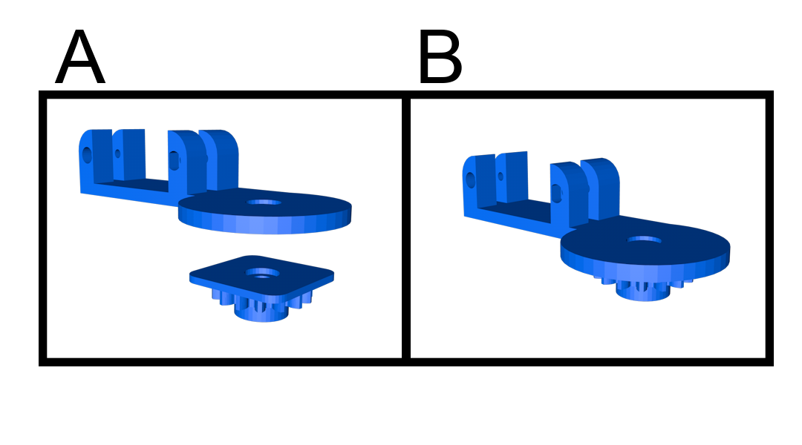

2. Introduce el tornillo del eje por el aspa del servo.

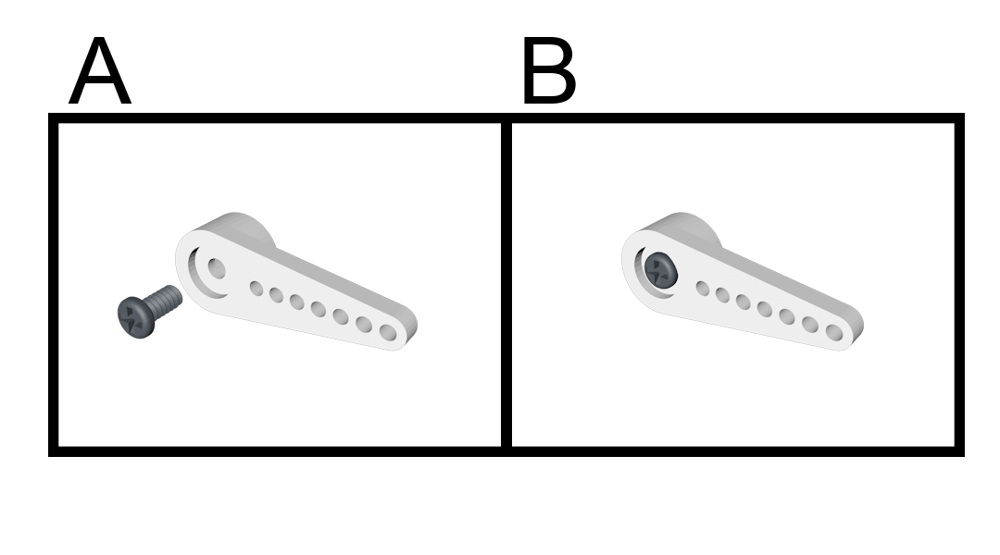

3. Atornilla la pieza blanca del servo a *CaraA.1_Pieza3.stl*.

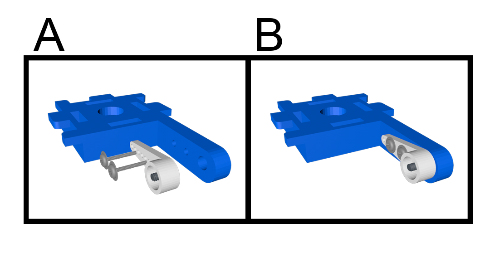

4. Introduce el iman de neodimio y los pines hembra en sus correspondientes orificios.

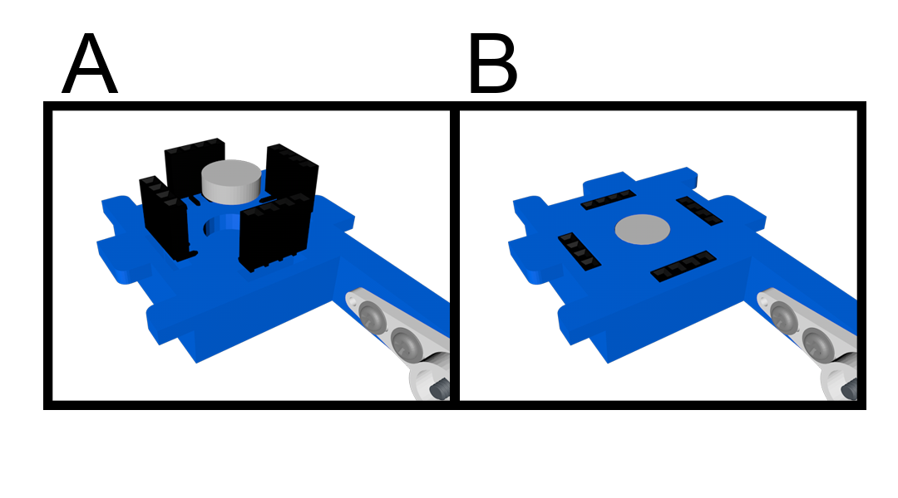

5. Suelda los pines hembra siguiendo los **RECUADROS ROJOS** del siguiente esquemático.

!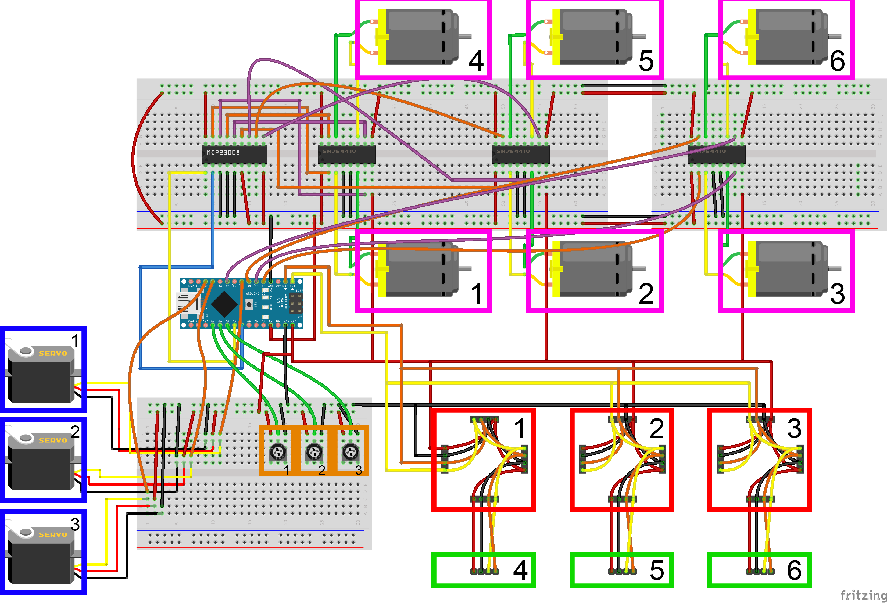

6. Introduce el Servo en su hueco.

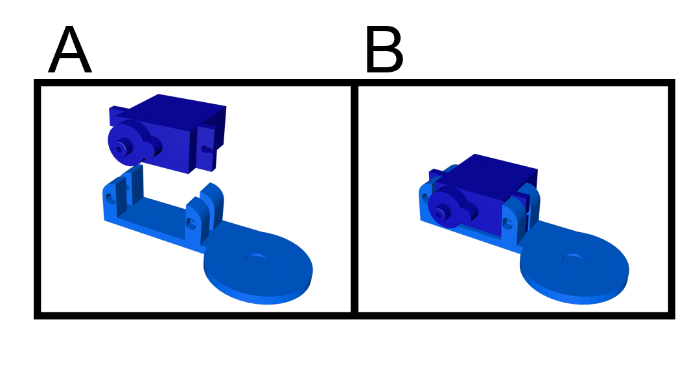

7. Atornilla el Servo.

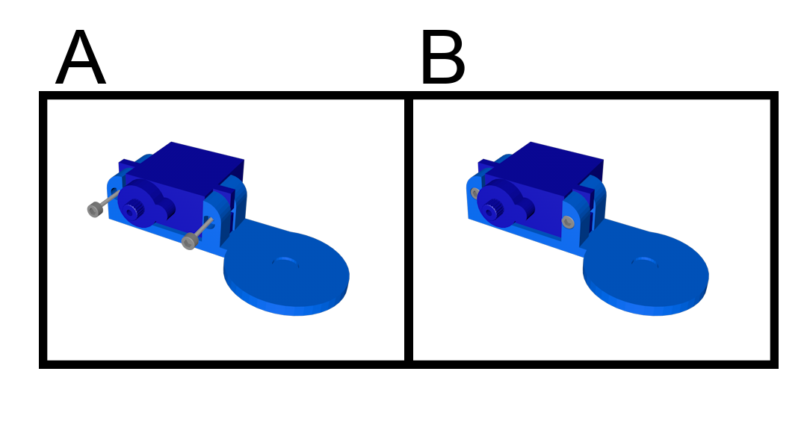

8. Atornilla las dos partes con el tornillo del eje.

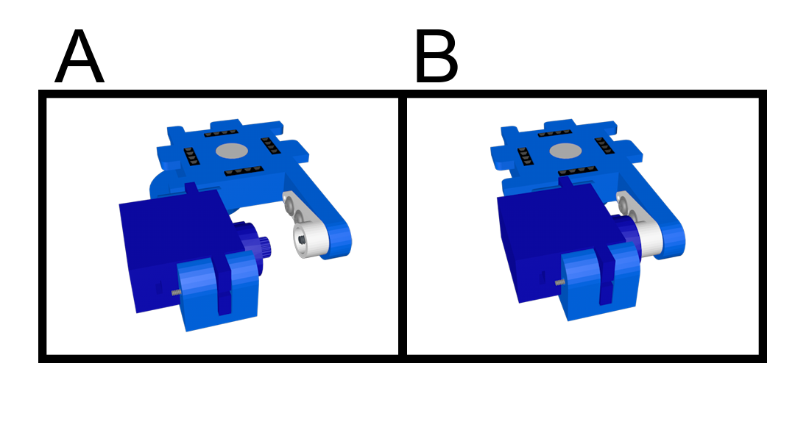

9. Repite el mismo proceso hasta tener las caras A.1 A.2 y A.3. Los archivos 3D son los mismos para las 3 caras. 

`Parte 2: Cuerpo`

#### 	Diseño:

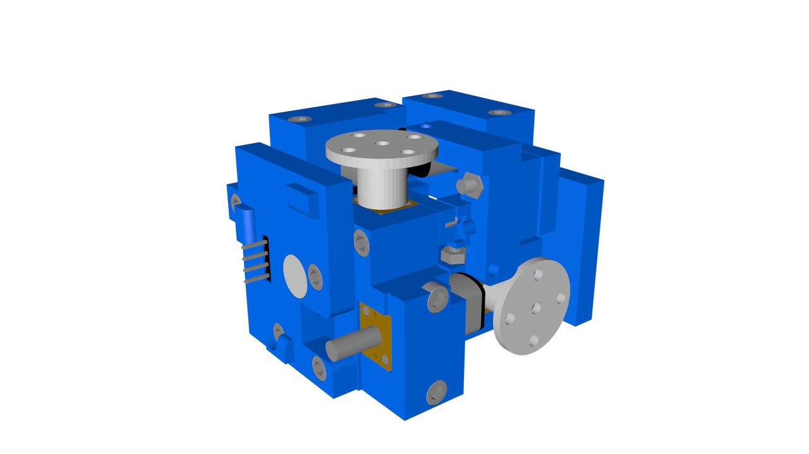

#### 	Archivos 3D:

[Cuerpo_Pieza1.stl](https://github.com/PabloGarciaJaen/qBOT_Repositorio/blob/master/Archivos%203D/Cuerpo_Pieza1.stl)

[Cuerpo_Pieza2.stl](https://github.com/PabloGarciaJaen/qBOT_Repositorio/blob/master/Archivos%203D/Cuerpo_Pieza2.stl)

[Cuerpo_Pieza3.stl](https://github.com/PabloGarciaJaen/qBOT_Repositorio/blob/master/Archivos%203D/Cuerpo_Pieza3.stl)

[Cuerpo_Pieza4.stl](https://github.com/PabloGarciaJaen/qBOT_Repositorio/blob/master/Archivos%203D/Cuerpo_Pieza4.stl)

[Cuerpo_Pieza5.stl](https://github.com/PabloGarciaJaen/qBOT_Repositorio/blob/master/Archivos%203D/Cuerpo_Pieza6.stl)

[Cuerpo_Pieza6.stl](https://github.com/PabloGarciaJaen/qBOT_Repositorio/blob/master/Archivos%203D/Cuerpo_Pieza6.stl)

[Cuerpo_Pieza7.stl](https://github.com/PabloGarciaJaen/qBOT_Repositorio/blob/master/Archivos%203D/Cuerpo_Pieza7.stl)

[Cuerpo_Pieza8.stl](https://github.com/PabloGarciaJaen/qBOT_Repositorio/blob/master/Archivos%203D/Cuerpo_Pieza8.stl)

[Cuerpo_Pieza9.stl](https://github.com/PabloGarciaJaen/qBOT_Repositorio/blob/master/Archivos%203D/Cuerpo_Pieza9.stl)

[Cuerpo_Pieza10.stl](https://github.com/PabloGarciaJaen/qBOT_Repositorio/blob/master/Archivos%203D/Cuerpo_Pieza10.stl)

[Cuerpo_Pieza11.stl](https://github.com/PabloGarciaJaen/qBOT_Repositorio/blob/master/Archivos%203D/Cuerpo_Pieza11.stl)

[Cuerpo_Pieza12.stl](https://github.com/PabloGarciaJaen/qBOT_Repositorio/blob/master/Archivos%203D/Cuerpo_Pieza12.stl)

[Cuerpo_Pieza13.stl](https://github.com/PabloGarciaJaen/qBOT_Repositorio/blob/master/Archivos%203D/Cuerpo_Pieza13.stl)

//Nota_1: Los archivos están optimizados para una correcta impresión 3D sin soportes

//Nota_2: Es posible que algunas tengas que quitar el hueco para los tornillos o limar algunas partes.

#### 	Componentes:

| Componente                               | Cantdidad |
| ---------------------------------------- | --------- |
| GearMotor N20 eje M4                     | 3         |
| GearMotor con eje sin rosca              | 3         |
| Acoplamiento para N20                    | 3         |
| Pin Macho (4 pines juntos)               | 3         |
| Imán Neodimio N42 9x3mm                  | 3         |
| Tornillo Allen M3 10mm Cabeza Cilíndrica | 13        |
| Tornillo Allen M3 20mm Cabeza Cilíndrica | 10        |
| Tuerca M3                                | 10        |

#### 	Montaje:

1. Corta la varilla de los motores de forma que dejes 10mm de rosca.

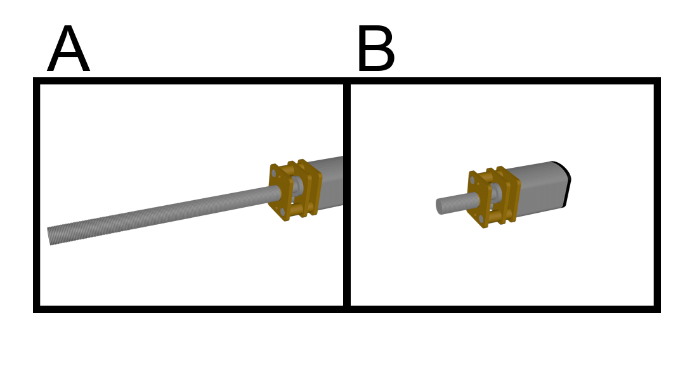

**//NOTA: Repite este paso 3 veces**

2. Une la el acoplamiento rígido a los motores no roscados.

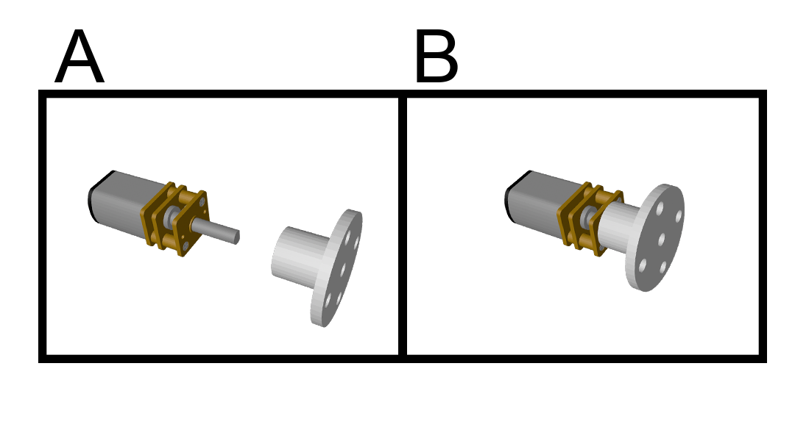

**//NOTA: Repite este paso 3 veces**

3. Atornilla *Cuerpo_Pieza1.stl* y *Cuerpo_Pieza2.stl* introduciendo el motor con eje.

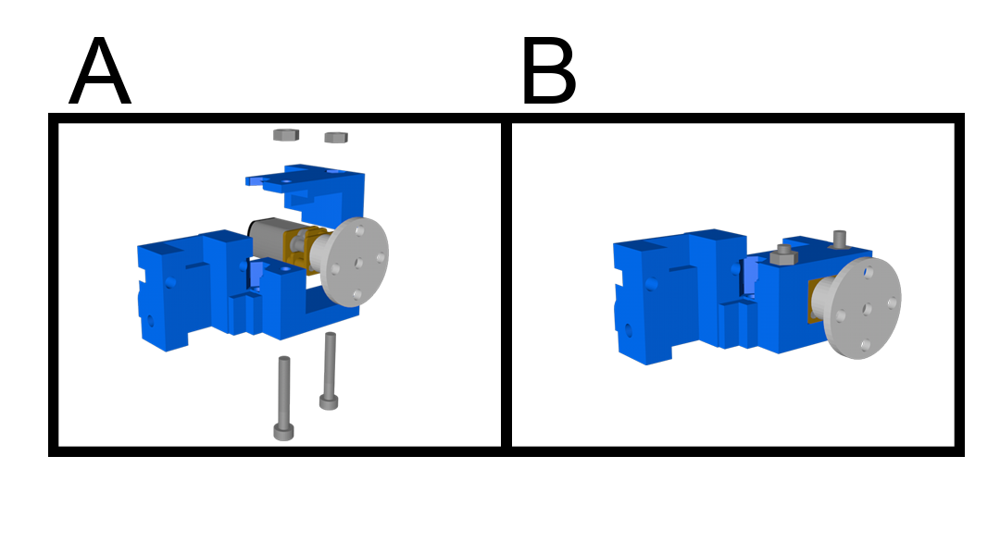

4. Atornilla *Cuerpo _Pieza3.stl* junto a la parte resultante del paso 3, introduciendo otro de los motores con eje.

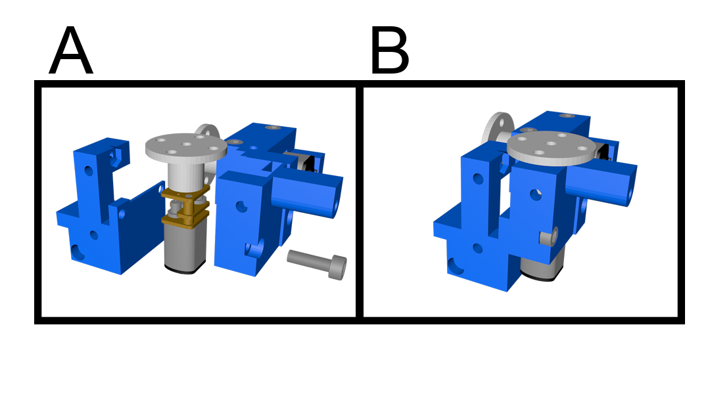

5. Introduce el último motor con eje en su correspondiente hueco y fijalo con *Cuerpo_Pieza4.stl*.

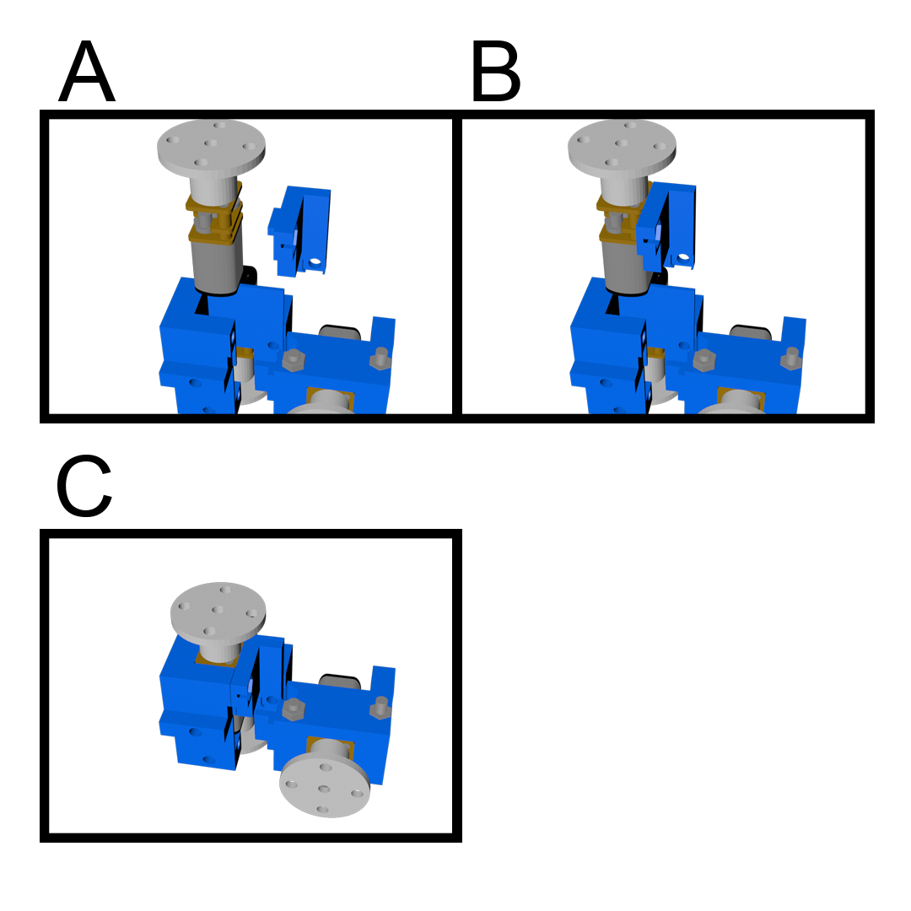

6. Atornilla el paso anterior.

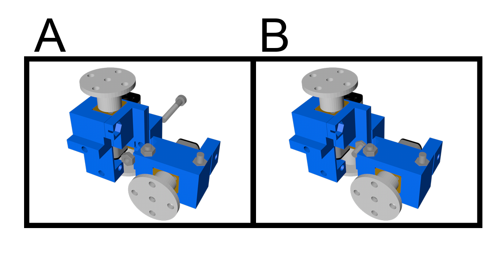

7. Introduce otro de los gearmotor y atornillalo junto a *Cuerpo_Pieza5*.

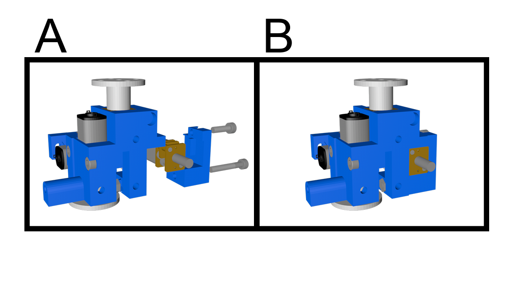

8. Atornilla *Cuerpo_Pieza6* junto al resto de la estructura.

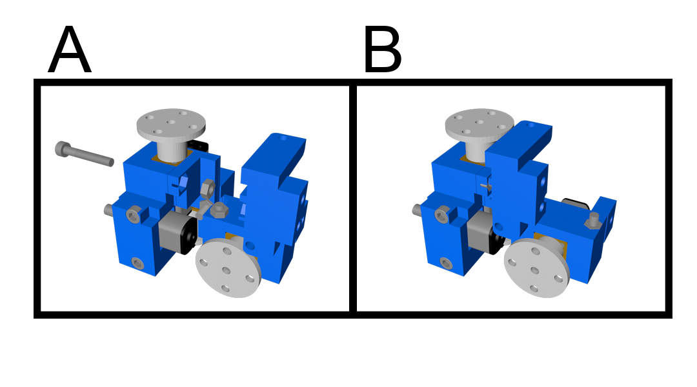

9. Atornilla *Cuerpo_Pieza7* junto al resto del cuerpo.

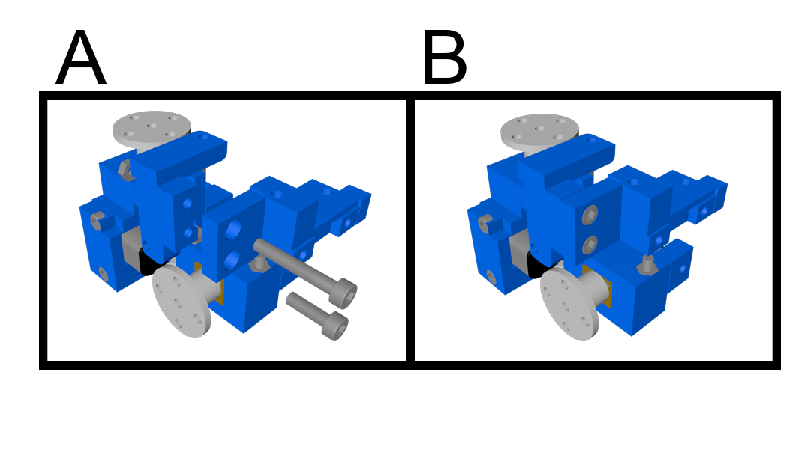

10. Atornilla uno de los gearmotor con rosca y *Cuerpo_Pieza8* a la estructura.

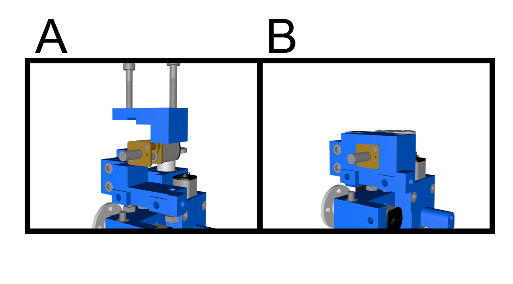

11. Pon los 4 pines macho, introduce el imán y atornilla *Cuerpo_Pieza9*. Recomendamos que introduzcas el iman y los pines (con cables soldados) antes de atornillarlo.

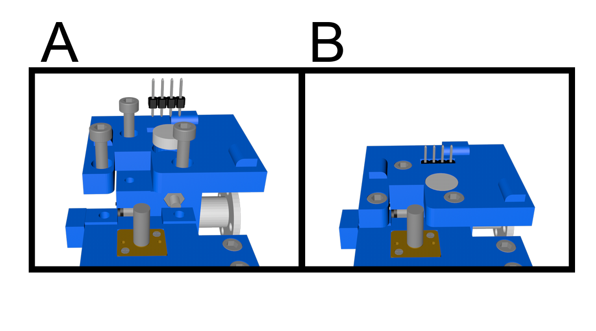

12. Pon los 4 pines macho, introduce el imán y atornilla *Cuerpo_Pieza10*. Recomendamos que introduzcas el iman y los pines(con cables soldados) antes de atornillarlo.

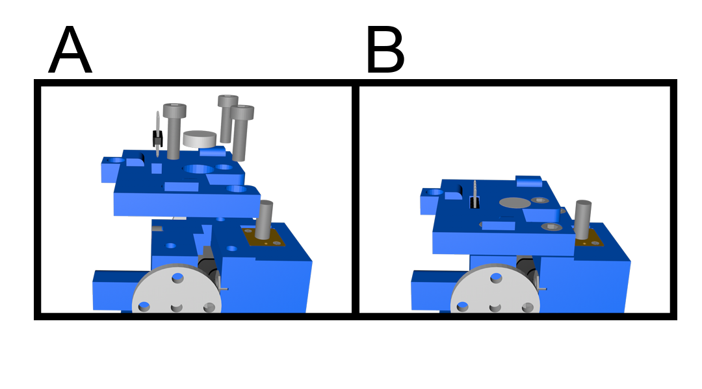

13. Atornilla el último gearmotor junto a *Cuerpo_Pieza11* y a *Cuerpo_Pieza12*

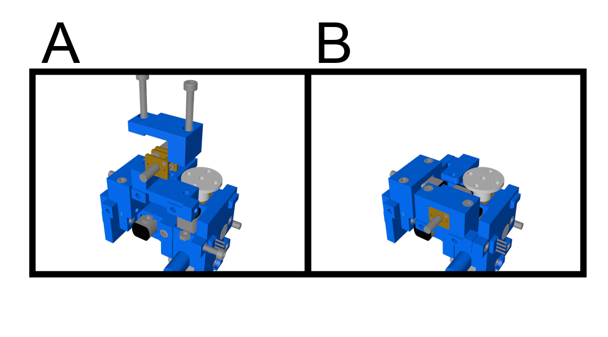

14. Pon los 4 pines macho, introduce el imán y atornilla *Cuerpo_Pieza13*. Recomendamos que introduzcas el iman y los pines(con cables soldados) antes de atornillarlo.

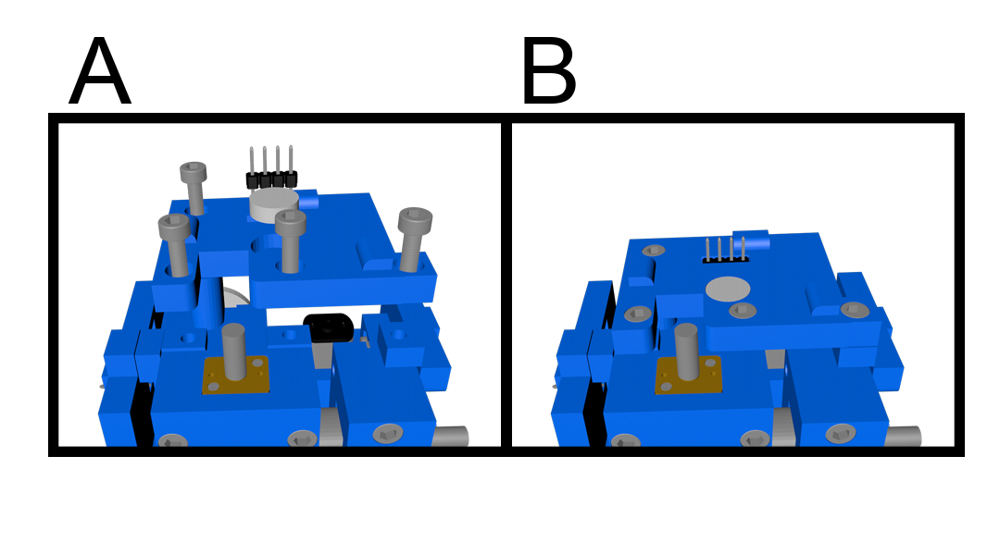

`Parte 3: Ejes`

`Parte 4: Brazos`

`Parte 5: Electrónica`
1. Suelda toda la electrónica siguiendo el siguiente esquemñatico
!

`Parte 5: Programación`
1. Compila y sube el siguiente código en tu Arduino (cada uno en su respectivo qBOT)
[Code_BLUE.ino](https://github.com/PabloGarciaJaen/qBOT_Repositorio/blob/master/Code_BLUE_/Code_BLUE_.ino)
[Code_ORANGE.ino](https://github.com/PabloGarciaJaen/qBOT_Repositorio/blob/master/Code_ORANGE/Code_ORANGE.ino)

#### 

`Paso 4`

Carga el programa en tu Arduino Nano y comienza a cacharrear!

`Paso 5`

Personaliza tu qBOT y súbelo para que los demás usuarios lo repliquen y lo disfruten.
